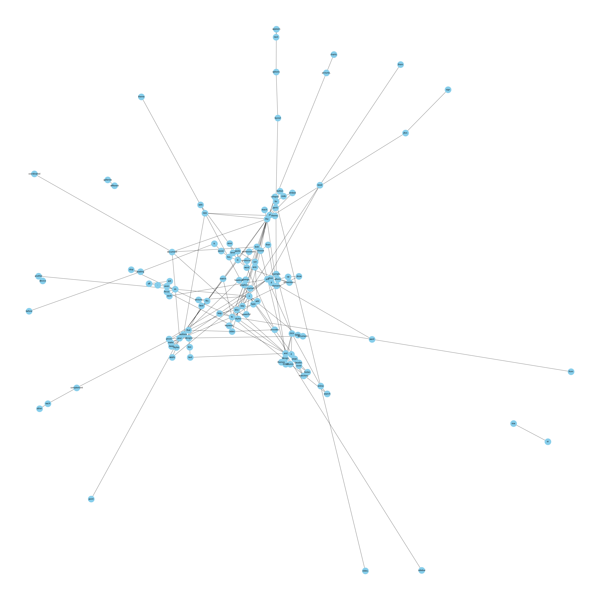
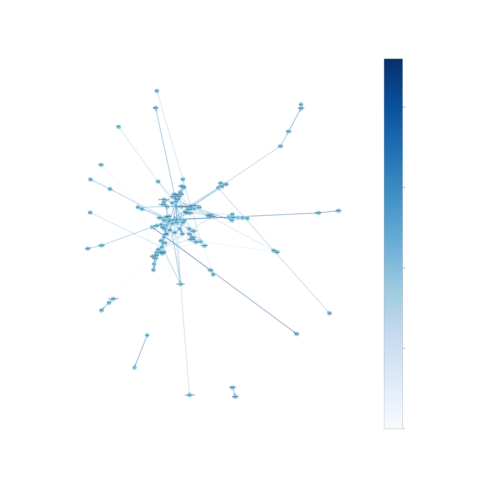

## Text Data Visualisation

Visualising text data in the form of graphs. 
This creates a graph of all the unique words in the text and connects the word nodes to the next word in the sentence.
The width and opacity of the edge represents the how many times did a word occur after a certain word.

Example:  
### Undirected Graph

### Directed Graph

